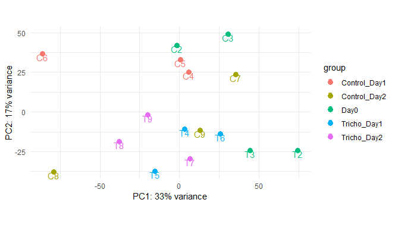
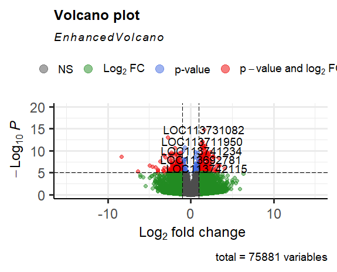
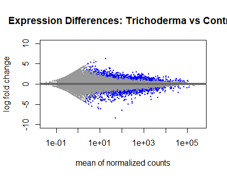
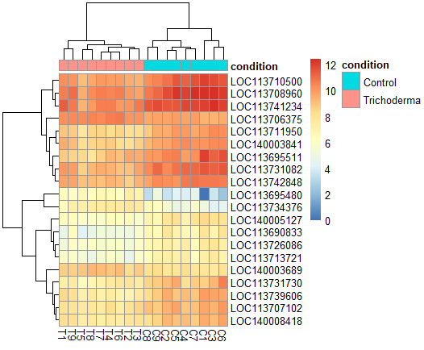

# Transcriptomics_Coffee_Trichoderma
Coffee plants were inoculated with Trichoderma rifaii CT5, and RNA was extracted from leaf tissue at three time points: prior to inoculation (Day 0), one day post-inoculation (Day 1), and two days post-inoculation (Day 3). Samples were collected from both inoculated plants (“Tricho”) and non-inoculated controls (“Control”).
This repository documents the complete workflow for differential expression analysis, including quality control, read trimming, sequence alignment, and quantification of gene expression.

## Step 1: Quality Control of Raw Data 
### Navigate to the folder that contains the raw ".fq.gz" files.  
```bash
cd /data2/lnoboa/tricho_transcriptomics/raw_data_tricho
```
### Activate the conda environment. 
```bash
conda activate transcriptomics_env
```
### Run FastQC to assess the quality of the sequences.  
```bash
fastqc *.fq.gz -o /data2/lnoboa/tricho_transcriptomics/fastqc_tricho/rawdata_fastqc
```
### Run MultiQC in the same folder. 
```bash
multiqc .
```
[Check the report](Results/multiqc_report_tricho-coffee-rawdata.html)

## Step 2: Trimming 
###Run the Trimmomatic tool to remove low quality reads and adapters. 
```bash
TRIMMOMATIC=/home/jupyter-alumno7/.conda/envs/rnseq/bin/trimmomatic
ADAPTERS=/home/jupyter-alumno7/.conda/envs/rnseq/share/trimmomatic/adapters/TruSeq3-PE.fa
THREADS=4
INPUT_DIR=/data2/lnoboa/tricho_transcriptomics/raw_data_tricho
OUTPUT_DIR=/data2/lnoboa/tricho_transcriptomics/trimmed_tricho

for f1 in $INPUT_DIR/*_1.fq.gz; do
    base=$(basename "$f1" _1.fq.gz)
    f2="$INPUT_DIR/${base}_2.fq.gz"
     
    $TRIMMOMATIC PE -threads $THREADS \
        "$f1" "$f2" \
        "$OUTPUT_DIR/${base}_1.trim.fq.gz" "$OUTPUT_DIR/${base}_1un.trim.fq.gz" \
        "$OUTPUT_DIR/${base}_2.trim.fq.gz" "$OUTPUT_DIR/${base}_2un.trim.fq.gz" \
        ILLUMINACLIP:$ADAPTERS:2:30:10 SLIDINGWINDOW:4:20 MINLEN:36
  done
```

## Step 3: Quality Control of the Trimmed Sequences 
### Navigate to the folder that contains the trimmed ".fq.gz" files.  
```bash
cd /data2/lnoboa/tricho_transcriptomics/trimmed_tricho
```
### Activate the conda environment. 
```bash
conda activate transcriptomics_env
```
### Run FastQC to assess the quality of the sequences.  
```bash
fastqc *.fq.gz -o /data2/lnoboa/tricho_transcriptomics/fastqc_tricho/trimmed_fastqc
```
### Run MultiQC in the same folder. 
```bash
multiqc .
```
[Check the report](Results/multiqc_trichotranscriptomics_trimmed.html)

## Step 4: Alignment to the Reference Genome 
### Create a folder for results. 
```bash
cd /data2/lnoboa/tricho_transcriptomics/
mkdir mapping_results
```
### Upload the genome index. 
[Reference genome](https://www.ncbi.nlm.nih.gov/datasets/genome/GCF_036785885.1/)
```bash
cd /data2/lnoboa/ref_genome_coffea
hisat2-build -p 4 GCF_036785885.1_Coffea_Arabica_ET-39_HiFi_genomic.fna coffea_index
```
### Mapping of sequences. 
#### Alignment of the trimmed sequences to the reference genome. 
```bash
cd /data2/lnoboa/tricho_transcriptomics/trimmed_tricho
for sample in *_1.trim.fq.gz; do
    base=$(basename $sample _1.trim.fq.gz)
    hisat2 -p 4 \
        -x /data2/lnoboa/ref_genome_coffea/coffea_index \
        -1 ${base}_1.trim.fq.gz \
        -2 ${base}_2.trim.fq.gz \
        -S /data2/lnoboa/mapping_results/${base}.sam
done
```
### Convert SAM to BAM. 
```bash
cd /data2/lnoboa/tricho_transcriptomics/mapping_results
for f in *.sam; do
    base=$(basename "$f" .sam)
    samtools sort "$f" -o "${base}_sorted.bam"
```
## Step 5: Quantification of Mapped Reads. 
```bash
/data2/lnoboa/tricho_transcriptomics/mapping_results
featureCounts -p -t exon -g gene_id   -a /data2/lnoboa/ref_genome_coffea/genomic.gtf   -o counts_matrix.txt /data2/lnoboa/tricho_transcriptomics/mapping_results/*_sorted.bam
```

## Step 6: Differential Expression Analysis with DESeq2 in R
### Install and load the recquired packages. 
```bash
if (!requireNamespace("BiocManager", quietly = TRUE)) install.packages("BiocManager")
BiocManager::install(c("DESeq2", "EnhancedVolcano"))
install.packages(c("ggplot2", "pheatmap"))
library(DESeq2)
library(ggplot2)
library(EnhancedVolcano)
library(pheatmap)
```
### Set the working directory. 
```r
setwd("D:/lucianoboa/royatranscriptomics/analysis/featureCounts_tricho")
```

### Load the count matrix. 
```r
countData <- read.table("counts_matrix_tricho.txt", header=TRUE, row.names=1, sep="\t")
```

### Check the column names.
```r
colnames(countData)
```

```r
 [1] "Chr"                                                                
 [2] "Start"                                                              
 [3] "End"                                                                
 [4] "Strand"                                                             
 [5] "Length"                                                             
 [6] "X.data2.lnoboa.tricho_transcriptomics.mapping_results.C1_sorted.bam"
 [7] "X.data2.lnoboa.tricho_transcriptomics.mapping_results.C2_sorted.bam"
 [8] "X.data2.lnoboa.tricho_transcriptomics.mapping_results.C3_sorted.bam"
 [9] "X.data2.lnoboa.tricho_transcriptomics.mapping_results.C4_sorted.bam"
[10] "X.data2.lnoboa.tricho_transcriptomics.mapping_results.C5_sorted.bam"
[11] "X.data2.lnoboa.tricho_transcriptomics.mapping_results.C6_sorted.bam"
[12] "X.data2.lnoboa.tricho_transcriptomics.mapping_results.C7_sorted.bam"
[13] "X.data2.lnoboa.tricho_transcriptomics.mapping_results.C8_sorted.bam"
[14] "X.data2.lnoboa.tricho_transcriptomics.mapping_results.C9_sorted.bam"
[15] "X.data2.lnoboa.tricho_transcriptomics.mapping_results.T1_sorted.bam"
[16] "X.data2.lnoboa.tricho_transcriptomics.mapping_results.T2_sorted.bam"
[17] "X.data2.lnoboa.tricho_transcriptomics.mapping_results.T3_sorted.bam"
[18] "X.data2.lnoboa.tricho_transcriptomics.mapping_results.T4_sorted.bam"
[19] "X.data2.lnoboa.tricho_transcriptomics.mapping_results.T5_sorted.bam"
[20] "X.data2.lnoboa.tricho_transcriptomics.mapping_results.T6_sorted.bam"
[21] "X.data2.lnoboa.tricho_transcriptomics.mapping_results.T7_sorted.bam"
[22] "X.data2.lnoboa.tricho_transcriptomics.mapping_results.T8_sorted.bam"
[23] "X.data2.lnoboa.tricho_transcriptomics.mapping_results.T9_sorted.bam"
```

### Select only the count columns (columns 6 to 21).
```r
countData <- countData[, 6:23]
```
### Check dimensions of the filtered count matrix.
```r
dim(countData)
```
```r
[1] 75881    18
```

### Rename columns with simpler sample names.
```r
colnames(countData) <- c("C1","C2","C3","C4","C5","C6","C7","C8","C9",
                         "T1","T2","T3","T4","T5","T6","T7","T8","T9")
```
### Define experimental conditions.
#### Eight samples H = 24 hours, Six samples T = 0 hours.
```r
condition <- factor(c(rep("Control", 9), rep("Trichoderma", 9)))
```
### Create colData with experimental metadata.
```r
colData <- data.frame(row.names = colnames(countData),
                      condition = condition)
```
### Assembly of the differential expression matrix.
```r
dds <- DESeqDataSetFromMatrix(countData = countData, 
                              colData = colData, 
                              design = ~ condition)

dds <- DESeq(dds)
res <- results(dds, contrast = c("condition", "Control", "Trichoderma"))
res <- res[order(res$padj), ]
head(res)
```
### Top differentially expressed genes (DEGs)
```r
head(res)
```
```r
log2 fold change (MLE): condition Day0 vs Tricho_Day1 
Wald test p-value: condition Day0 vs Tricho_Day1 
DataFrame with 6 rows and 6 columns
              baseMean log2FoldChange     lfcSE      stat      pvalue        padj
             <numeric>      <numeric> <numeric> <numeric>   <numeric>   <numeric>
LOC113717248  1630.813        1.43842  0.153489   9.37148 7.15240e-21 2.58430e-16
LOC113732041  1707.242        3.31360  0.392295   8.44670 2.99655e-17 5.41358e-13
LOC113734275  2875.550        1.40462  0.175406   8.00779 1.16786e-15 1.40657e-11
LOC113725802   769.526        2.29509  0.291388   7.87643 3.36881e-15 3.04304e-11
LOC113700219  7606.002        3.83103  0.519457   7.37506 1.64265e-13 1.18704e-09
LOC113739496   324.082        2.84338  0.386998   7.34726 2.02305e-13 1.21828e-09
```

### DESeq2 Summary of Differential Expression (Trichoderma vs Control)
```r
out of 49371 with nonzero total read count
adjusted p-value < 0.1
LFC > 0 (up)       : 2043, 4.1%
LFC < 0 (down)     : 794, 1.6%
outliers [1]       : 230, 0.47%
low counts [2]     : 13009, 26%
(mean count < 8)
[1] see 'cooksCutoff' argument of ?results
[2] see 'independentFiltering' argument of ?results
```

###  Principal Component Analysis (PCA) of Samples
```r
rld <- rlog(dds, blind = TRUE)
plotPCA(rld, intgroup = "condition", pcsToUse = 1:2, ntop = 70000) +
  geom_text(aes(label = name), vjust = 1) +
  theme_minimal()
```


### Volcano Plot of Differentially Expressed Genes
```r
EnhancedVolcano(res,
                lab = rownames(res),
                x = "log2FoldChange",
                y = "pvalue",
                xlim = c(-15, 15))
```


### MA Plot of Differential Expression
```r
plotMA(res,
       alpha = 0.1,
       main = "Trichoderma vs Control",
       ylim = c(-10, 10))
```


### Most Differentially Expressed Genes Heatmap
```r
top_genes <- row.names(res)[1:20]
counts_top <- log2(counts(dds, normalized = TRUE)[top_genes,] + 1)
pheatmap(counts_top, annotation_col = colData)
```


## Grouping Samples and Comparing Differential Expression
#### At this stage, we compare plants inoculated with Trichoderma versus control plants at one and two days post-inoculation. In the PCA plot, we observed that samples C6 and C8 showed irregular expression patterns compared to the other control samples, so they were excluded from this analysis.
```r
countData <- countData[, c("C4","C5","C7","C9",
                           "T4","T5","T6","T7","T8","T9")]
condition <- factor(c(rep("Control", 4), rep("Trichoderma", 6)))
colData <- data.frame(row.names = colnames(countData),
                      condition = condition)
```
### Build and run DESeq analysis. 
```r
dds <- DESeqDataSetFromMatrix(countData = countData, 
                              colData = colData, 
                              design = ~ condition)

dds <- DESeq(dds) 
```
